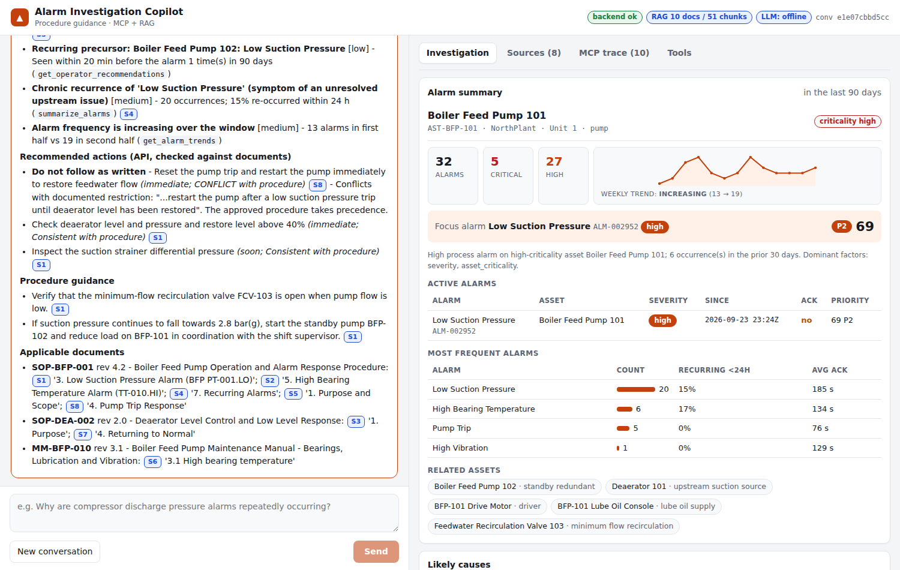
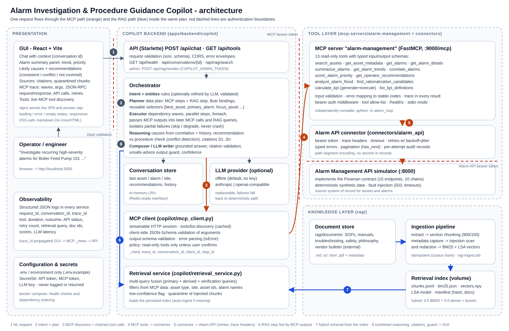

# Alarm Investigation and Procedure Guidance Copilot

**Senior Software Engineer – Copilot Integration assignment.** A production-oriented copilot that investigates
industrial alarms. It calls the Alarm Management API **only through a purpose-built MCP server**, retrieves
operating procedures with **document RAG**, combines both inside **one plan**, and answers with **citations**
and a full **MCP execution trace** in a React GUI.

> **Demo video (up to 10 min):** _add link after upload_ - see [`docs/demo-script.md`](docs/demo-script.md) for the recording script.
> Screenshots: [`docs/screenshots/`](docs/screenshots).



---

## Contents

1. [Selected use case](#1-selected-use-case)
2. [Main capabilities](#2-main-capabilities)
3. [Technology stack](#3-technology-stack)
4. [Quick start](#4-quick-start)
5. [Configuration](#5-configuration)
6. [Build, run and test commands](#6-build-run-and-test-commands)
7. [MCP server](#7-mcp-server)
8. [Document RAG](#8-document-rag)
9. [Architecture summary](#9-architecture-summary)
10. [Sample interactions](#10-sample-interactions)
11. [Repository layout](#11-repository-layout)
12. [Assumptions](#12-assumptions)
13. [Known limitations and future work](#13-known-limitations-and-future-work)

---

## 1. Selected use case

**Alarm Investigation and Procedure Guidance Copilot.** Operators and reliability engineers ask in plain language,
for example *"Investigate recurring high-severity alarms for Boiler Feed Pump 101 over the last 90 days, identify
likely contributing factors, retrieve the relevant operating procedure, and provide recommended actions with source
evidence."* The copilot:

1. discovers the MCP tools and resolves the asset name to an asset id (`search_assets`),
2. retrieves alarms, a summary with recurrence/acknowledgement KPIs and a trend (`get_alarms`, `summarize_alarms`,
   `get_alarm_trends`),
3. fetches asset metadata and related assets (`get_asset_metadata`),
4. correlates alarms across the asset and its related assets (`correlate_alarms`) and scores the focus alarm
   (`score_alarm_priority`),
5. gets the API's operator recommendations (`get_operator_recommendations`),
6. retrieves the relevant procedure passages with RAG, using filters and queries **derived from the MCP results**,
7. **checks every API recommendation against the procedures** (consistent / conflict / not covered),
8. returns a grounded answer with `[S#]` citations, likely causes with evidence, and an expandable tool trace.

## 2. Main capabilities

| Area | What is implemented |
| --- | --- |
| **Alarm API simulator** | Implements every endpoint, auth header, trace header, pagination rule and chaining flow in the Postman collections (all 3 collections pass: 15 + 32 + 15 requests). Deterministic synthetic data for 25 assets and ~3,000 alarms over 365 days. Fault injection (per-trace transient 503s, a persistent outage for SouthPlant recommendations, and timeout/500 headers). |
| **MCP server** (`alarm-management`) | 13 read-only tools with typed input **and** output schemas, input validation (enums, ranges, id patterns, semantic checks), bearer auth, timeout + retry with backoff, errors mapped to stable codes, `trace_id` propagation, pagination, structured logs, tool allow-list, streamable HTTP + stdio. |
| **MCP client** | Tool discovery (cached), client-side JSON-Schema validation of arguments, output-schema validation, read-only policy (write tools need confirmation), error parsing, `_meta` trace propagation. |
| **Orchestration** | Intent + entity detection → data-driven **plan** (MCP steps + RAG step) → executor running dependency **waves** in parallel, passing outputs through **selectors**, `foreach` fan-out, partial-failure isolation → reasoning → composer. Conversation context for follow-ups ("this alarm"). |
| **Document RAG** | 10 documents (.md, .txt, .html, .pdf) → extraction → heading-aware chunking with overlap → metadata → prompt-injection scan and redaction → BM25 + LSA dense vectors → hybrid retrieval with hard and soft filters, relaxed-filter fallback, multi-query fusion, low-confidence detection, quarantine of injected chunks, citations. |
| **Answer generation** | Deterministic grounded composer (default, no API key) or a replaceable LLM (Anthropic / OpenAI-compatible) with citation validation and an unsafe-advice output guard. |
| **GUI** | React + Vite: chat, alarm summary panel (KPIs, trend sparkline, active alarms, priority), likely causes, recommendation verdicts, citations with snippets, retrieval diagnostics and quarantined chunks, an expandable MCP trace (JSON-RPC request/response, upstream API calls, retries, errors), a live tool-discovery view, loading/error/empty states and a responsive layout. |
| **Quality** | 128 automated tests (unit, MCP server, MCP client over real HTTP, RAG, orchestration, E2E), ruff (including security rules), mypy strict-ish, CI with coverage, a newman contract job, pip-audit / npm audit / gitleaks and a Docker smoke test. |

## 3. Technology stack

| Layer | Choice |
| --- | --- |
| Language | Python 3.11 (services), TypeScript (GUI) |
| MCP | Official `mcp` Python SDK 1.27 (FastMCP server, `ClientSession` + streamable HTTP client) |
| HTTP services | Starlette + Uvicorn (simulator, MCP host app, copilot API), httpx (clients) |
| Contracts | Pydantic v2 models, JSON Schema (`jsonschema`) for client-side validation |
| RAG | Custom pipeline: PyYAML / stdlib HTML parser / pypdf extraction, BM25 + LSA (numpy) hybrid index on disk; optional `fastembed` embeddings |
| LLM | Pluggable: `offline` (default), `anthropic`, `openai` (any OpenAI-compatible endpoint) |
| GUI | React 18 + Vite 5, no UI kit (plain CSS with light/dark themes) |
| Packaging | Docker (one Python image + nginx GUI image), Docker Compose with health checks and dependency ordering |
| Quality | pytest, pytest-cov, ruff, mypy, vitest, newman, pip-audit, gitleaks, GitHub Actions |

## 4. Quick start

**Prerequisites:** Docker with Compose v2.24+ (or Python 3.11 + Node 22 for local runs).

```bash
git clone <repo-url> senior-copilot-mcp-rag-assignment && cd senior-copilot-mcp-rag-assignment
cp .env.example .env            # optional; defaults work out of the box
docker compose up --build
```

| Service | URL | Notes |
| --- | --- | --- |
| **GUI** | http://localhost:3000 | start here |
| Copilot API | http://localhost:8080/api/health | `POST /api/chat`, `GET /api/tools` |
| MCP server | http://localhost:9000/mcp (health: `/healthz`) | bearer token `MCP_SERVER_TOKEN` |
| Alarm API simulator | http://localhost:8000/health | bearer token `ALARM_API_TOKEN` |

Start-up order is enforced with health checks: `alarm-api` → `alarm-mcp` → `rag-ingest` (one-shot index build) →
`copilot-backend` → `frontend`.

### Run locally without Docker

```bash
make install                 # Python deps (runtime + dev)
make ingest                  # build the RAG index into .rag_index/
make run-sim                 # terminal 1 - Alarm API simulator  :8000
make run-mcp                 # terminal 2 - MCP server           :9000/mcp
make run-backend             # terminal 3 - copilot backend      :8080
make install-frontend && make run-frontend   # terminal 4 - GUI  :5173
```

## 5. Configuration

All configuration comes from environment variables (see [`.env.example`](.env.example)). Secrets are `SecretStr`
values: they are never logged, never returned in tool results or traces, and are masked in `repr`.

| Variable | Used by | Default | Purpose |
| --- | --- | --- | --- |
| `ALARM_API_BASE_URL` | MCP server | `http://alarm-api:8000` | source-system URL |
| `ALARM_API_TOKEN` | simulator, MCP server | `demo-token` | API bearer token |
| `ALARM_API_TIMEOUT_SECONDS` / `ALARM_API_MAX_RETRIES` | MCP server | `10` / `2` | per-attempt timeout, retry budget |
| `MCP_SERVER_URL` | backend | `http://alarm-mcp:9000/mcp` | MCP endpoint |
| `MCP_SERVER_TOKEN` | MCP server, backend | `change-me-mcp-token` | MCP bearer token |
| `MCP_ENABLED_TOOLS` | MCP server | *(all)* | tool allow-list |
| `MCP_ALLOWED_HOSTS` | MCP server | *(off)* | Host-header allow-list (DNS-rebinding guard) |
| `LLM_PROVIDER` / `LLM_API_KEY` / `LLM_MODEL` / `LLM_BASE_URL` | backend | `offline` | optional LLM |
| `DOCUMENT_PATH` / `RAG_INDEX_PATH` / `EMBEDDING_PROVIDER` | ingestion, backend | `rag/documents` / `.rag_index` / `lsa` | RAG |
| `DEFAULT_LOOKBACK_DAYS` | backend | `90` | investigation window |
| `COPILOT_ADMIN_TOKEN` | backend | *(off)* | enables `POST /api/rag/reindex` |
| `SIM_FAULTS` / `SIM_FAULT_CLIENTS` | simulator | `POST /alarms/correlation=503x1` / `alarm-mcp-server` | demo fault injection |
| `SIM_ANCHOR_TIME` | simulator | today 00:00 UTC | data anchor (history spans 365 days before it) |

## 6. Build, run and test commands

```bash
make lint          # ruff check + format check (includes flake8-bandit security rules)
make typecheck     # mypy over all Python packages
make test          # full suite: unit + RAG + MCP + orchestration + e2e (128 tests)
make coverage      # pytest-cov -> htmlcov/ and coverage.xml
make postman       # run the three Postman collections against a running simulator
make up / make down
cd apps/frontend && npm test && npm run build
```

Test layout (see [`docs/coverage-summary.md`](docs/coverage-summary.md) for per-file coverage, about 95% of lines):

| Suite | Path | Covers |
| --- | --- | --- |
| Unit | `tests/unit` | simulator contract, API connector (payloads, auth/trace headers, retries, timeouts, pagination, no secret leakage), intent/tool selection, planner and selectors, citation formatting, conflict detection, composer, prompt-injection and output guard, LLM providers, config secrets |
| RAG | `rag/tests` | extraction of md/txt/html/pdf, metadata, chunk size and overlap, idempotent ingestion, injection flagging, retrieval relevance, filters, fallback, no-result/low-confidence, quarantine, citation correctness, multi-query fusion |
| MCP server | `tests/integration/test_mcp_server.py` | registration and discovery, typed schemas, allow-list, invalid inputs, semantic validation, error mapping, retries visible in traces, pagination, all advanced tools, trace sanitisation, bearer auth, health |
| MCP client | `tests/integration/test_mcp_client.py` | real streamable-HTTP server: connect, discover, invoke, `_meta` trace propagation, chaining, client-side schema validation, missing tool, partial failure, wrong token, unreachable server |
| Orchestration | `tests/integration/test_orchestration.py` | multi-step chains, outputs passed forward, RAG fed by MCP, partial failures, unavailable tools, MCP down, conflicting evidence, context retention, foreach, KPI and general questions, LLM guard |
| E2E | `tests/e2e/test_e2e_mcp_rag.py` | HTTP `POST /api/chat` → real MCP server → simulator plus RAG → grounded answer with citations and trace; degraded scenario; input validation |

## 7. MCP server

`mcp-servers/alarm-management/alarm_mcp` - see the full **[MCP tool catalog](docs/mcp-tool-catalog.md)**
(generated from the live server: schemas, errors, timeouts, example invocations and responses).

**Run it independently:**

```bash
export PYTHONPATH=.:mcp-servers/alarm-management
ALARM_API_BASE_URL=http://localhost:8000 ALARM_API_TOKEN=demo-token MCP_SERVER_TOKEN=dev-mcp-token \
  python -m alarm_mcp                       # streamable HTTP on :9000/mcp
python -m alarm_mcp --transport stdio        # stdio, e.g. for MCP Inspector:
npx @modelcontextprotocol/inspector python -m alarm_mcp --transport stdio
```

| Tool | API operation |
| --- | --- |
| `search_assets` | `GET /assets/search` |
| `get_asset_metadata` | `GET /assets/{id}/metadata` |
| `get_alarms` | `GET /alarms` (pagination, `fetch_all_pages`) |
| `get_alarm_details` | `GET /alarms/{id}` |
| `summarize_alarms` | `POST /alarms/summary` |
| `get_alarm_trends` | `POST /alarms/trends` |
| `correlate_alarms` | `POST /alarms/correlation` |
| `score_alarm_priority` | `POST /alarms/priority-score` |
| `get_operator_recommendations` | `POST /recommendations/operator-actions` |
| `analyze_alarm_flood` | `POST /alarms/flood-analysis` |
| `find_rationalization_candidates` | `POST /alarms/rationalization-candidates` |
| `calculate_kpi` | `POST /calculation-code/generate` + `/execute` |
| `list_kpi_definitions` | `GET /analytics/kpi-definitions` |

## 8. Document RAG

Corpus (`rag/documents`, synthetic but realistic): 3 operating procedures, 2 maintenance manuals, 2
troubleshooting guides, 1 safety instruction (PDF), 1 alarm-management philosophy, and 1 **external vendor bulletin
that contains a planted prompt-injection** used to demonstrate quarantine. Details in
**[docs/rag-design.md](docs/rag-design.md)**.

```bash
python -m rag.ingestion --docs rag/documents --index .rag_index           # idempotent (corpus hash)
python -m rag.ingestion --docs rag/documents --index .rag_index --force   # rebuild
curl "localhost:8080/api/rag/search?q=restart%20after%20low%20suction%20pressure%20trip"
```

## 9. Architecture summary



`GUI → copilot API → orchestrator (intent → plan → executor) → MCP client ⇢ [MCP bearer] ⇢ MCP server → connector
⇢ [API bearer] ⇢ Alarm API`, while the plan's RAG step calls the retrieval service over the index built by the
ingestion pipeline. Read the full request flow in **[docs/architecture.md](docs/architecture.md)**, decisions in
[docs/design-decisions.md](docs/design-decisions.md) and integration details in
[docs/api-integration.md](docs/api-integration.md).

## 10. Sample interactions

| Ask | What happens |
| --- | --- |
| *Investigate recurring high-severity alarms for Boiler Feed Pump 101 over the last 90 days …* | 9 MCP calls in 4 waves (one transient 503 retried) + RAG. Top cause: **Deaerator 101 low level → low suction pressure** (69% confidence, 9 co-occurrences, cited SOP-DEA-002/SOP-BFP-001). The API's "restart the pump immediately" is flagged as a **conflict** with SOP-BFP-001 §4. |
| *Are the API recommendations consistent with the maintenance manual?* (follow-up) | Uses the alarm from context → `get_alarm_details` + `get_operator_recommendations` + RAG → "2 of 3 consistent, 1 conflict". |
| *Which operating procedure applies to this alarm?* | Context alarm → applicable procedure section + steps with citations. |
| *Show active critical alarms for Boiler Feed Pump 102 and recommend immediate actions.* | Severity/status filters flow into the tools; vibration procedure steps are cited. |
| *Why are compressor discharge pressure alarms repeatedly occurring?* | Generic equipment → candidates ranked by matching alarm activity → K-301; cause **E-301 cooler high outlet temperature** from correlation, corroborated by TG-CMP-003; injected vendor note quarantined. |
| *Which alarm has the highest priority in EastRefinery, and why?* | Active alarms → `foreach` priority scoring (parallel) → the top alarm's rationale, asset and recommendations. |
| *What related assets should be inspected for this motor trip alarm?* | Motors ranked by trip activity → metadata relationships + correlation (MCC-501 undervoltage) + TG-MTR-005. |
| *Investigate alarms for Cooling Water Pump 301* | **Degraded:** the recommendation engine is down (503 after 3 attempts) → medium confidence, procedure guidance only, warning shown. |
| *What does the alarm philosophy say about shelving?* | RAG-only answer with quoted passages. |
| *Investigate Boiler Feed Pump 999* | The asset can't be resolved → clarification request, dependent steps skipped. |

A full example response is in [`test-data/acceptance_response.example.json`](test-data/acceptance_response.example.json).

## 11. Repository layout

```text
.
├── apps/
│   ├── alarm-api-simulator/alarm_simulator/   # Alarm Management API simulator (Postman contract)
│   ├── backend/copilot/                        # copilot API, orchestration, MCP client, reasoning, LLM
│   └── frontend/                               # React + Vite GUI (nginx image)
├── mcp-servers/alarm-management/alarm_mcp/     # candidate-developed MCP server
├── connectors/alarm_api/                       # reusable HTTP connector (auth, retry, errors, pagination)
├── rag/
│   ├── documents/                              # sample corpus (md, txt, html, pdf)
│   ├── ingestion/                              # extract → chunk → scan → index  (python -m rag.ingestion)
│   ├── retrieval/                              # BM25, LSA embeddings, hybrid retriever, index store
│   └── tests/                                  # ingestion + retrieval tests
├── tests/{unit,integration,e2e}/               # test suites (shared fixtures in conftest.py)
├── postman/                                    # reference collections (API contract)
├── test-data/                                  # example responses and retrieval evaluation set
├── scripts/                                    # catalog generator, Postman runner, coverage, sample PDF
├── docs/                                       # architecture, catalog, RAG design, decisions, limitations
├── Dockerfile · docker-compose.yml · Makefile · .env.example · .github/workflows/ci.yml
```

> The required structure lists `mcp-servers/alarm-management/` and `apps/backend/`. Python packages live one level
> below (`alarm_mcp`, `copilot`, `alarm_simulator`) because hyphenated folders are not importable; `PYTHONPATH` is
> set in `pyproject.toml`, the `Makefile`, the Dockerfile and CI. There is no `optional-secondary-server`; see
> [known limitations](docs/known-limitations.md).

## 12. Assumptions

- The Postman collections are the API contract. Response shapes not fixed by them (e.g. correlation `pairs`) were
  designed to be useful and are documented in [docs/api-integration.md](docs/api-integration.md).
- Simulator data is synthetic and deterministic (seed 42), anchored to "today" so that "last 90 days" always has
  data; `SIM_ANCHOR_TIME` pins it (tests use 2026-07-01).
- The copilot is **read-only**: no ticketing or write operations were required. The client policy already refuses
  non-read-only tools without explicit confirmation.
- Offline mode (no LLM) is the default so that evaluation needs no API keys; an LLM can be enabled via env vars.
- Documents are synthetic samples with the structure of real SOPs and manuals (no restricted content).

## 13. Known limitations and future work

See **[docs/known-limitations.md](docs/known-limitations.md)**. In short: rule-based intent detection covers the
alarm-investigation domain but not open-ended conversation without an LLM; the LSA embeddings are corpus-local
(swap in `fastembed` / a vector DB for larger corpora); the conversation store is in memory; there is no user-level
authentication in the GUI.
